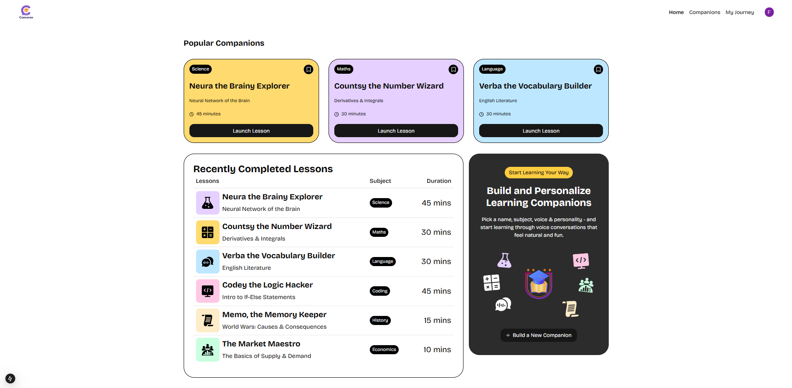

# 🗣️ Converso

**Converso** is an AI-powered Learning Management System (LMS) SaaS application designed to help users learn new topics through engaging, high-quality AI voice lessons. Built with **Next.js**, **Supabase**, **Clerk**, and **Vapi**, Converso offers a modern, personalized learning experience accessible from anywhere.

---

## 🚀 Features

- 🎧 **AI Voice Lessons**: Learn by listening with dynamic, human-like AI narration.
- 📚 **Topic-Based Learning**: Choose from a growing library of subjects or create your own.
- 🧠 **Adaptive Learning Flow**: Personalized progress tracking and content recommendation.
- 🔐 **Secure Authentication**: Seamless user management with Clerk.
- ☁️ **Real-Time Backend**: Supabase provides scalable database, auth, and storage services.
- 🗣️ **Vapi Integration**: Leverages Vapi to deliver smooth, high-quality voice synthesis.

---

## 🛠️ Tech Stack

- **Frontend**: [Next.js](https://nextjs.org/)
- **Backend**: [Supabase](https://supabase.com/)
- **Authentication**: [Clerk](https://clerk.dev/)
- **Voice AI**: [Vapi](https://vapi.ai/)

---

## 🧩 Architecture

Converso (Next.js App)
├── Auth & User Management (Clerk)
├── Database & APIs (Supabase)
├── AI Voice Generation (Vapi)
└── Frontend Pages (Lessons, Dashboard, Admin, etc.)
